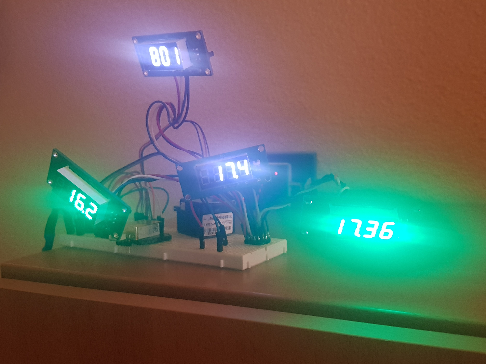

# SDS021  

Arduino library for dust Sensor SDS011 and SDS021 (Nova Fitness Co.,Ltd)  
This library uses SoftSerial to connect to the SDS021.  

This library is based on the SDS011 library by ricki-z
<a href="https://github.com/ricki-z/SDS011">https://github.com/ricki-z/SDS011</a>

It is an attempt to implement the full serial protocol specified by Nova Fitness.

The class offers the following functions:

<pre>
class SDS021 {
	public:
		SDS021(void);
		void begin(	uint8_t pin_rx, uint8_t pin_tx, uint8_t devid_one = 0xFF, uint8_t devid_two = 0xFF );
		bool workMode( 			uint8_t *result, 	uint8_t mode = SDS021_REPORTMODE,	uint8_t set = SDS021_ASK );
		bool queryData( float *ppm10, 		float *ppm25 );
		bool setDeviceId( 		uint8_t result[2], 	uint8_t new_one, uint8_t new_two );
		bool sleepWork( 		uint8_t *result, 	uint8_t awake = SDS021_WORKING,uint8_t set = SDS021_ASK);
		bool workPeriod(		uint8_t *result, 	uint8_t minutes = 0,uint8_t set = SDS021_ASK);
		bool firmwareVersion( 	uint8_t result[3]);
		void setDebug( 			bool onoff );
	private:
		uint8_t _pin_rx, _pin_tx;
		uint8_t _devid_one, _devid_two;
		bool _debug;
		bool txrCommand( uint8_t q[19], uint8_t b[10]);
		Stream *sds_data;		
};
</pre>

 <h2>SDS021::workMode() datasheet (1)</h2>
 
 result will contain either SDS021_QUERYMODE or SDS021_REPORTMODE,
 depending on how it was set by this function ( by setting
 argument set to SDS021_SET), or how it was set before if argument
 set was set to SDS021_ASK.

 <h2>SDS021::queryData() datasheet (2)</h2>
 
 returns ppm10 and ppm2.5 values

 <h2>SDS021::setDeviceId() datasheet (3)</h2>
 
 Device id is two bytes, the factory sets each device to a unique id.
 New id will be returned in result. 
 By default any device is addressed by address FF FF. This is the default
 for this library as not many people will connect more than one device
 to the same serial lines. If this default (FF FF) is used, class instance
 device id (_devid_one and _devid_two ) will not be updated with this
 new device address, and FF FF will continued to be used to address the device.

<h2>SDS021::sleepWork() datasheet (4)</h2>
 
 result will contain either SDS021_WORKING or SDS021_SLEEPING,
 depending on how it was set by this function ( by setting
 argument set to SDS021_SET), or how it was set before if argument
 set was set to SDS021_ASK.
 
 When the device is working it draws around 60 mA. When sleeping,
 laser and fan are turned off. Current drops to 1.8 mA.
 See also the example sketch.

<h2>SDS021::workPeriod() datasheet (5)</h2>
 
 result will contain 0 ( for continuous mode) or the Interval
 time in minutes (for interval mode). According to the datasheet
 device will sleep during the interval and become active 30 seconds 
 before the interval is reached. 

 See also the example. When device wakes up, one read is enough.
 Subsequent reads will return the same value until the next workperiod.
 Current draw in between workperiods is around 16 mA, which is much higher
 than after sending the device to sleep by calling sleepWork.

<h2>SDS021:firmwareVersion() datasheet (6)</h2>

 result[3] contains firmware date as YY, MM, DD if succesful, 
 else FF FF FF 

<h2>SDS021::setDebug( bool onoff )</h2>

<h2>SDS021::txrCommand()</h2>
 
 Executes and checks communication with the Nova SDS011 and
 SDS021 (maybe more) as documented in 
 Laser Dust Sensor Control Protocol V1.3
 which can (could?) be found here: 
 <a href="https:cdn.sparkfun.com/assets/parts/1/2/2/7/5/Laser_Dust_Sensor_Control_Protocol_V1.3.pdf">Laser_Dust_Sensor_Control_Protocol_V1.3.pdf</a>
 PC software ( which must be run in Windows 8 compatible mode on Windows 10 or else it will not find COM ports)
 was found here:
 <a href="https:d11.baidupcs.com/file/c6eb943e8a08202bf5cd721f023ef8c3?bkt=p3-0000aa6552059697d82e4a8edeee9d287b81&xcode=c2be2503d99003e9627aa2a060c0e38f5487d123a70d3c03fbe59cdc8f3909f058443de5464f1e91&fid=2959855691-250528-662993853982798&time=1522405446&sign=FDTAXGERLQBHSKa-DCb740ccc5511e5e8fedcff06b081203-a27Ffwr9zL799nznmjWLNxTlUww%3D&to=d11&size=9536562&sta_dx=9536562&sta_cs=969&sta_ft=rar&sta_ct=6&sta_mt=5&fm2=MH%2CYangquan%2CAnywhere%2C%2Cnoord-holland%2Cany&vuk=282335&iv=0&newver=1&newfm=1&secfm=1&flow_ver=3&pkey=0000aa6552059697d82e4a8edeee9d287b81&sl=76480590&expires=8h&rt=sh&r=916169565&mlogid=8976280318308348179&vbdid=1848654031&fin=Laser+PM2.5+Sensor+Software+V1.88.rar&fn=Laser+PM2.5+Sensor+Software+V1.88.rar&rtype=1&dp-logid=8976280318308348179&dp-callid=0.1.1&hps=1&tsl=80&csl=80&csign=ZMLyV6T0L9zkkwFfMOo%2F4sxc4LA%3D&so=0&ut=6&uter=4&serv=0&uc=2759677928&ic=3656030823&ti=cdac69781712398020903087bfa8b4c16944a2effab9d69e305a5e1275657320&by=themis">
 on baidu</a>
 

